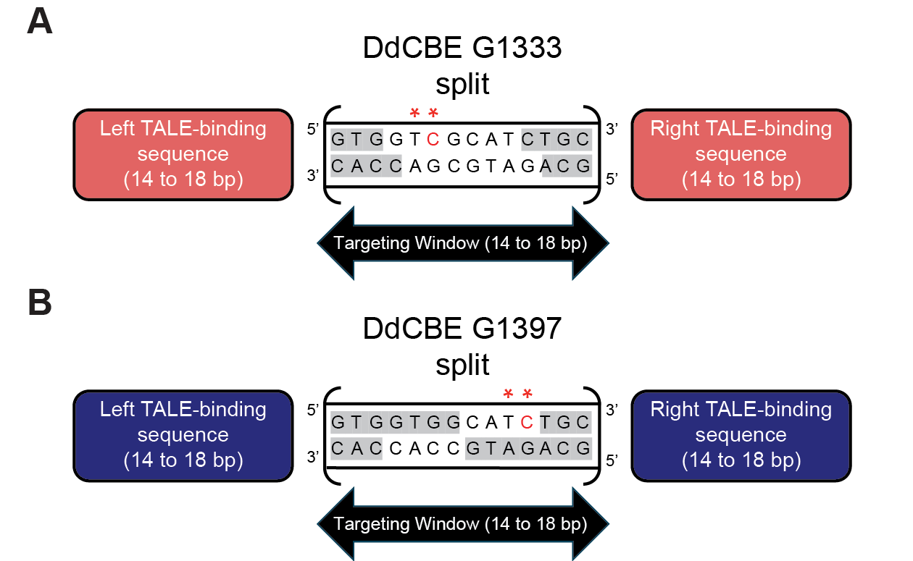
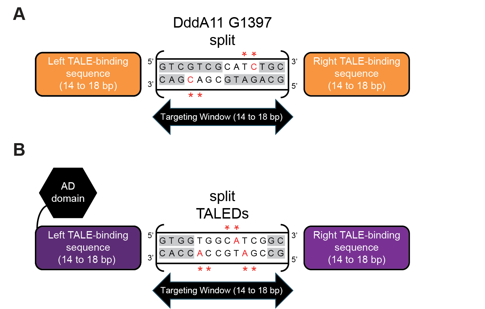

# Editing Pipelines
### 1. [Mok2020_G1333](https://www.nature.com/articles/s41586-020-2477-4)

#### Purpose
This pipeline predicts target windows for **C.G-to-T.A** conversions in a **5'-TC context** using the **G1333 DddA split.**
#### Steps

1. Find all **5’-TC** on top and bottom strand of DNA sequence.
2. To introduce a **C>T mutation** (target C is on the top stand), generate target windows (14-18bp) with the target C at positions 4-10bp from the 5' end **(on the top strand).**
3. To introduce a **G>A mutation** (target C is on the bottom strand), generate target windows (14-18bp) with the target C at positions 4-10bp from the 5' end **(on the bottom strand).**
4. Extract a **60bp adjacent sequence** (30bp on each side of the target base).
5. Use the extracted 60bp sequence to identify **optimal flanking TALE sequences** with the **TALE-NT tool.**
6. Identify all other cytosines in the target window that fulfill conditions listed in #2 and #3 and mark as **bystander edit(s)**.
7. Mark the **second C in a 5'-TCC context**, where the cytosine is 4-10bp from the 5’ end on either strand, as a bystander.
8. Mark target bases with **[  ]** and bystander bases with **{  }**.
9. Compile the final target windows with **optimal TALE sequences,** where applicable, and inlcude potential **effects of bystander edits.**
### 2. [Mok2020_G1397](https://www.nature.com/articles/s41586-020-2477-4)

#### Purpose
This pipeline predicts target windows for **C.G-to-T.A** conversions in a **5'-TC context** using the **G1397 DddA split.**
#### Steps

1. Find all **5’-TC** on top and bottom strand of DNA sequence.
2. To introduce a **C>T mutation** (target C is on the top stand), generate target windows (14-18bp) with the target C at positions 4-7bp from the 3' end **(on the top strand).**
3. To introduce a **G>A mutation** (target C is on the bottom strand), generate target windows (14-18bp) with the target C at positions 4-7bp from the 3' end **(on the bottom strand).**
4. Extract a **60bp adjacent sequence** (30bp on each side of the target base).
5. Use the extracted 60bp sequence to identify **optimal flanking TALE sequences** with the **TALE-NT tool.**
6. Identify all other cytosines in the target window that fulfill conditions listed in #2 and #3 and mark them as **bystander edit(s)**.
7. Mark the **second C in a 5'-TCC context**, where the cytosine is 4-7bp from the 3’ end on either strand, as a bystander.
8. Mark target bases with **[  ]** and bystander bases with **{  }** brackets.
9. Compile the final target windows with **optimal TALE sequences,** where applicable, and inlcude potential **effects of bystander edits.**

*Diagram depicting the editing patterns observed by DdCBE base editors among select publications used for validation. Cytosines within a 5’-TC context (double red asterisks) are edited by the G1333 DddA split (A) when located 4-10 bp from the 5’ end and are edited by the G1397 DddA split (B) when located 4-7bp from the 3’ end. Target cytosines (red font) within the regions highlighted in white are accessible to the base editor for C>T editing.*

### 3. [Mok2022_G1397_DddA11](https://www.nature.com/articles/s41587-022-01256-8)

#### Purpose
This pipeline predicts target windows for **C.G-to-T.A** conversions in a **5'-HC context (where H = A, C or T)** using the **modified DddA domain.**
#### Steps
1. Find all **5’-HC (H = A ,C, T)** on the top and bottom strand of DNA sequence.
2. To introduce a **C>T mutation** (target C is on the top stand), generate target windows (14-18bp) with the target C at positions 4-7bp from the 3' end **(on the top strand).**
3. To introduce a **G>A mutation** (target C is on the bottom strand), generate target windows (14-18bp) with the target C at positions 4-7bp from the 3' end **(on the bottom strand).**
4. Extract a **60bp adjacent sequence** (30bp on each side of the target base).
5. Use the extracted 60bp sequence to identify **optimal flanking TALE sequences** with the **TALE-NT tool.**
6. Identify all other cytosines in the target window that fulfill conditions listed in #2 and #3 and mark as **bystander edit(s)**.
7. Mark target bases with **[ ]** and bystander bases with **{ }**.
8. Compile the final target windows with **optimal TALE sequences,** where applicable, and inlcude potential **effects of bystander edits.**
   
### 4. [Cho_sTALEDs](https://pubmed.ncbi.nlm.nih.gov/35472302/)
#### Purpose
This pipeline predicts target windows for **A.T-to-G.C** conversions in a **5'-AS or 5'-SA context (where S = C or G)** using the **AD domain.**
#### Steps
1. Find all **5’-SA (S = G, C)** and **5'-AS (S = G, C)** on the top and bottom strand of DNA sequence.
2. To introduce a **A>G mutation** (target A is on the top stand), generate target windows (14-18bp) with the target A at positions 5-12bp from the end containing the AD domain **(on the top strand).**
3. To introduce a **T>C mutation** (target A is on the bottom strand), generate target windows (14-18bp) with the target A at positions 5-12bp from the end containing the AD domain **(on the bottom strand).**
4. Extract a **60bp adjacent sequence** (30bp on each side of the target base).
5. Use the extracted 60bp sequence to identify **optimal flanking TALE sequences** with the **TALE-NT tool.**
6. Identify all other adenines that fulfill conditions listed in #2 and #3 and mark as **bystander edit(s)**.
7. The pipeline accounts for both possibilities, with the **AD domain** present either at the **5' and 3' end** which is delineated in the *sTALED Type* column.
8. Mark target bases with **[ ]** and bystander bases with **{ }**.
9. Compile the final target windows with **optimal TALE sequences,** where applicable, and inlcude potential **effects of bystander edits.**

#### Note:
- If the target base is followed or preceded by an A/T, the neighboring A/T is also considered a potential bystander edit, causing the *Flag CheckBystanderEffect* column to display `TRUE`. However, it has not yet been confirmed whether this is an actual bystander edit, so the position of this base is not marked or displayed.

*(A) The evolved DddA11 variant exhibits a similar pattern to the DdCBE G1397 split, but with a modified editing context (5’-HC, where H = A, C or T) to target cytosines. (B) The split TALED (sTALED) base editor targets adenines 5-12 base pairs (bp) from the end closest to the TALE (right or left) fused to the deoxyadenine deaminase (AD) domain. Here, the AD is depicted with the left TALE sequence. sTALEDs follow an editing pattern similar to the DdCBE G1397 split, but with a modified context (5’-SA or 5’-AS, where S = G or C) to target adenines. In both (A) and (B), regions highlighted in white are accessible to the base editors. Double red asterisks indicate the editing context and red font indicates the targeted base(s).*
